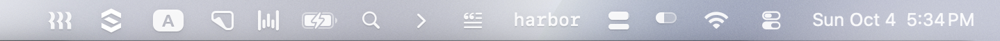
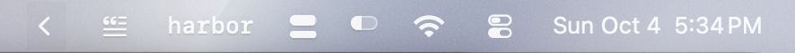

# Bar Manager

A minimal Bartender. One chevron in the macOS menu bar; everything to its left folds away.
Single Swift file, no dependencies.

Expanded:



Collapsed:



## Install

```sh
./build.sh --install
```

Needs the Xcode Command Line Tools. Builds `~/Applications/Bar Manager.app` and launches it.

## Use

- Hold ⌘ and drag an icon to the left of the chevron to hide it. Drag it back to show it.
- Click the chevron to show or hide. It hides again on its own after a delay.
- Right-click the chevron for the delay, Launch at Login, and Quit.
- To move the chevron, show the icons first, then ⌘-drag it.

macOS pins Wi‑Fi, battery, the clock and Control Center on the far right, so those cannot be hidden.

## How it works

Hiding stretches the status item to the width of the screen, which pushes everything left of it off
the bar. macOS stops drawing an item once it no longer fits, so while hidden the chevron is a small
borderless window floating where the item ends. Clicking it shrinks the item back.

Settings live in `defaults` under `com.kobe.bar-manager`. `defaults delete com.kobe.bar-manager`
resets them.
